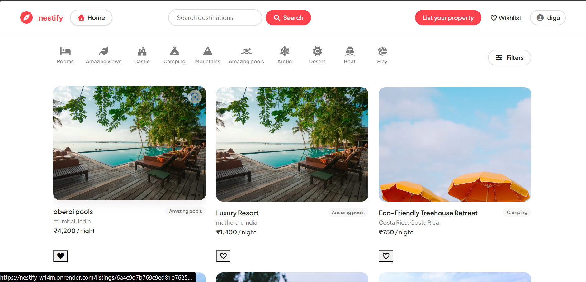
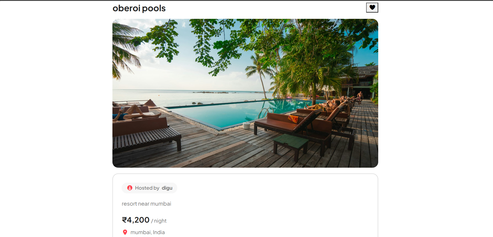
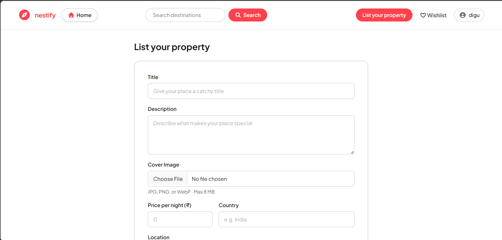
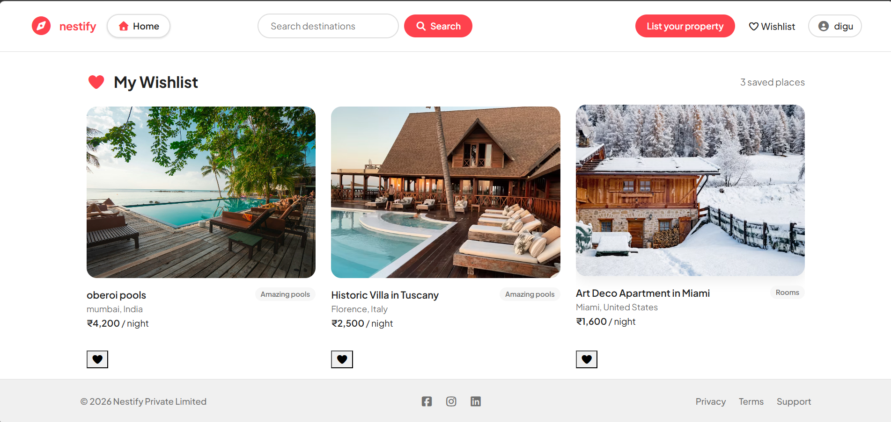
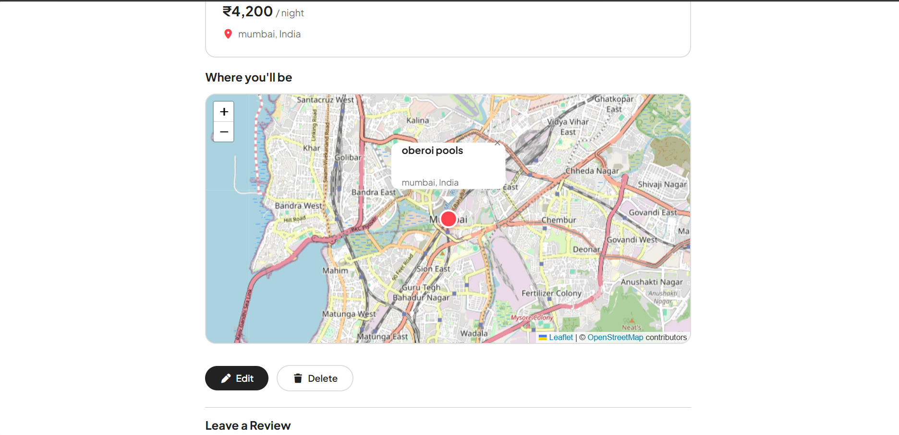
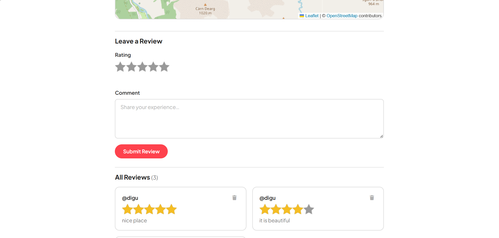

# 🏡 Nestify

Nestify is a full-stack Airbnb-inspired web application where users can explore, create, manage, and review property listings. It provides secure authentication, image uploads, interactive maps, wishlists, and a responsive user interface.

---

## ✨ Features

- 🔐 User Authentication (Register, Login, Logout)
- 🏠 Create, Edit & Delete Property Listings
- 📷 Single Cover Image Upload using Cloudinary
- 🗺️ Interactive Maps using Leaflet & OpenStreetMap
- ❤️ Wishlist Functionality
- ⭐ Ratings & Reviews
- 🔍 Search Listings
- 🏷️ Category-based Listings
- 📱 Fully Responsive Design
- ⚡ Flash Messages
- 🛡️ Input Validation using Joi
- 🔒 Authorization (Only owners can edit/delete their listings)

---

## 🛠 Tech Stack

### Frontend
- HTML5
- CSS3
- Bootstrap 5
- JavaScript
- EJS

### Backend
- Node.js
- Express.js

### Database
- MongoDB Atlas
- Mongoose

### Authentication
- Passport.js
- Passport Local
- Express Session

### Cloud & APIs
- Cloudinary
- OpenStreetMap
- Leaflet

---

## 📂 Project Structure

```text
config/
controllers/
init/
models/
public/
routes/
utils/
views/
app.js
middleware.js
cloudConfig.js
package.json
```

---

## 🚀 Installation

Clone the repository

```bash
git clone <your-repository-url>
```

Move into the project

```bash
cd MAJORPROJECT
```

Install dependencies

```bash
npm install
```

Create a `.env` file in the project root.

Add the following environment variables:

```env
ATLASDB_URL=your_mongodb_connection_string

SECRET=your_session_secret

CLOUD_NAME=your_cloudinary_name
CLOUD_API_KEY=your_cloudinary_api_key
CLOUD_API_SECRET=your_cloudinary_api_secret
```

Start the server

```bash
npm start
```

Open

```
http://localhost:8080
```

---

## 📸 Screenshots

### Home Page


---

### Listing Details


---

### Create Listing



---

### Wishlist



---

### Map



---

### reviews



---

## 🔒 Security Features

- Password Hashing
- Session-based Authentication
- Authorization Checks
- Joi Validation
- Secure Environment Variables
- Protected Routes

---

## 🌱 Future Improvements

- Booking System
- Payment Gateway
- User Profiles
- Email Verification
- Notifications
- Advanced Filters

---

## 👨‍💻 Author

**Sarvesh Natulkar**

GitHub:
https://github.com/Sarveshnatulkar

LinkedIn:
https://linkedin.com/in/sarvesh-natulkar-3627552a8

---